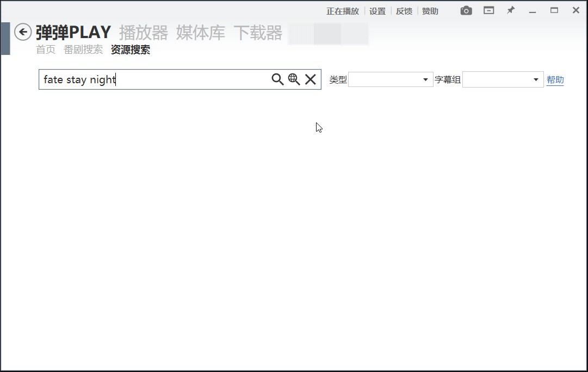

# dandanplay-resource-service 简要文档

## 搜索指令

> 关于“搜索指令”的详细规范、具体实现及使用细节，另见 [*Search Options*](SearchOptions.md) 文档。

搜索指令，是用于修改 API 节点默认行为的一系列 指令/参数 。

### 使用方法

在原搜索关键词后添加形如 `$option` 或 `$option:X` 的指令即可。  

- 其中 `option` 为指令名， `X` 为该指令对应的参数值，且 `X` 应为自然数。
- 建议将指令追加到搜索词后，而非插入到搜索词中。可以同时使用多个指令，指令与搜索词间应以空格分隔。
- 指令在 弹弹play 的 自动下载 界面也可使用。

## 指令

### $realtime

|    指令     |  建议形式   |       作用       |
| :---------: | :---------: | :--------------: |
| `$realtime` | `$realtime` | 是否进行实时搜索 |

当番剧资源刚发布后的一段时间内，虽然其在 [dmhy 首页](https://share.dmhy.org/) 可见，但无法通过关键词搜索到，即暂时不会出现在搜索结果页中。[#1](https://github.com/LussacZheng/dandanplay-resource-service/issues/1)
此时可以追加指令 `$realtime` 来将这些“延迟”资源的信息一并返回给客户端。

### $page

|  指令   | 建议形式  |         作用          |
| :-----: | :-------: | :-------------------: |
| `$page` | `$page:X` | 获取搜索结果的第 X 页 |

当搜索热门或长篇番剧时，搜索结果往往不止一页，弹弹play 会提示 “搜索结果过多，请重新设定更精确的搜索条件”。
此时你可以追加关键词进行筛选，或使用 `$page:2` 来获取第二页的搜索结果。

### $limit

|   指令   |  建议形式  |            作用            |
| :------: | :--------: | :------------------------: |
| `$limit` | `$limit:X` | 限制搜索结果的数量上限为 X |

搜索结果的数量默认不设上限。
你可以通过 `$limit:X` 来减少返回的资源数量。当 `0 < X < 80` 时才能体现出作用。

---

## 其他

> _暂无_
